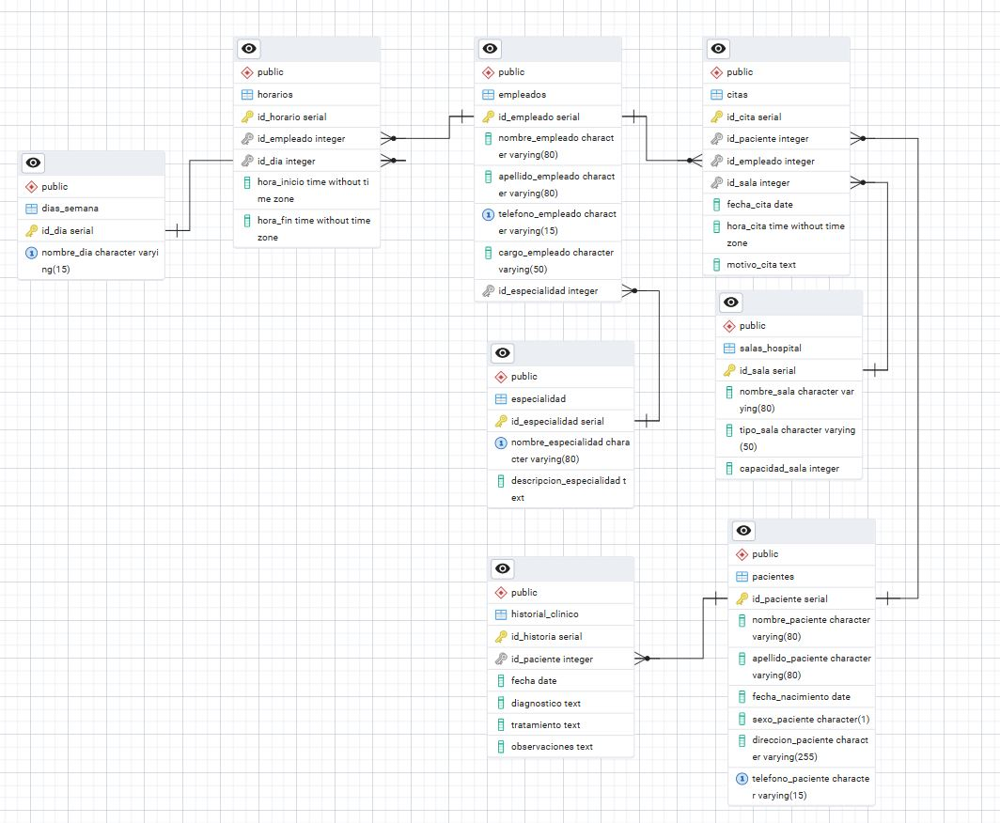

# FastApi Project - Zalud Integral

> Zalud-Integral nació con una visión clara: combinar la excelencia médica con el poder transformador de la automatización. Desde su creación, ha marcado diferencia con su enfoque clínico y técnico; cuenta con salas organizadas como módulos dentro de un sistema bien estructurado, donde cada espacio cumple una función sin interferir con los demás, quirófanos equipados como centros de datos, salas de emergencia que responden tan rápido como un script bien afinado, y una red interna que mantiene la información circulando con más estabilidad que un DNS local bien cacheado.

La plantilla médica y administrativa no solo cura, también optimiza, cada empleado ha sido capacitado para interactuar con sistemas pensados en la comodidad, rapidez y seguridad tanto del paciente como del profesional. Aquí, las historias clínicas fluyen por API internas, las citas se agendan con lógica predictiva, y los horarios se sincronizan como cron jobs en una arquitectura diseñada para escalar. Zalud-Integral representa una nueva era de centros hospitalarios donde lo humano se cuida con cariño y lo digital con maestría. 

## Construído con: 

- Python
- FastAPI (framework para construir la API RESTful: rápido, moderno y asincrónico)
- SQLAlchemy (para interactuar con PostgreSQL)
- Pydantic	(validación de datos con modelos BaseModel en schemas.py)
- venv (entorno virtual para aislar dependencias)

## Guía rápida para ejecutar proyecto Módulo I:

### Ejecutar en la terminal de VS CODE:
.\venv\Scripts\activate # En Windows

### Instalar dependencias necesarias
pip install fastapi sqlalchemy pydantic

### Ejecutar archivo main.py
fastapi dev .\app\main.py

### Abrir la documentación interactiva
http://127.0.0.1:8000/docs

## Test
Prueba el código

## Autor

👤 **Zayleth Vegas**

- GitHub: [@Zayleth](https://github.com/Zayleth)

## Contribución

Se agradecen contribuciones, reportes de errores y sugerencias de nuevas funciones. Siéntete libre de revisar la sección de issues o enviar un pull request si deseas colaborar. [issues page](issues/).

## Apoyo

⭐⭐⭐⭐⭐

## Inspiración

- Projecto Módulo I. Curso Postgres: https://postgres-course.vercel.app/ 

## 📝 License

This project is [CC0 1.0 Universal](LICENSE) licensed.